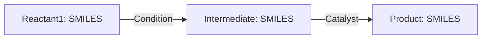

# 任务说明：医药分子图表理解
按照步骤指示完成任务，并严格按照指定格式进行结构化输出

## （1）如果图像不是表格形式：

请完成以下任务：

- 提取每个有指代符号的分子，并匹配其 SMILES。
- 若图中有通用取代基（如 `R`, `$R_1$`, `X` 等），请一并提取并标注。
- 若图像为流程图，请识别其中涉及的**反应物、反应条件与产物**，并以 Mermaid 格式画出反应流程。

#### 输出要求，两部分的规则化输出内容

第一部分.JSON文件：输出分子指代符号与其 SMILES 表达式的对应关系，请根据图像实际情况进行对应，格式如下所示：（下面的内容仅作为例子）

```json
{
  "2a": "C[@@]H",
  "R": "H",
  "$R_{1}$": "CC(C)n1c(=O)ccc2c1ccn2-c1c(Cl)cc(-n2nc(C#N)c(=O)[nH]c2=O)cc1Cl",
  "compound11": "CC(C)n1c(=O)ccc2c1ccn2-c1c(Cl)cc(-c3nn(*)c(=O)[nH]c3=O)cc1Cl<sep><a>21:R</a>"
}
```
第二部分.Markdown：对图像进行结构化描述，包括提到的每个分子的功能、改进过程等。所有涉及的化学结构请用SMILES表达式表示（如无 SMILES 可用，再用分子名代替）。如果图中为反应流程，请使用 Mermaid 语法展示，格式例如：



---

## （2）如果图像是表格形式（如 SAR 表格）：

此类图像通常包含结构–活性关系分析，展示多个衍生化合物及其性质（如 IC50、溶解性等），并可能含有多个二维结构图或取代基。

##### 表格图像理解任务输出要求，你需要规则化输出两部分的内容：

第一部分.JSON文件：提取所有红框中分子的指代符号及其对应的 SMILES，输出标准化的对照关系，请将图中的分子与smiles中对应起来，输出格式如下所示（下面的内容仅作为例子）

```json
{
  "2a": "C[@@]H",
  "compound11": "CC(C)n1c(=O)ccc2c1ccn2-c1c(Cl)cc(-c3nn(*)c(=O)[nH]c3=O)cc1Cl<sep><a>21:R</a>"
}
```

第二部分.Markdown 表格：将原始表格结构转化为 Markdown 格式,将表格中的全部内容转成markdown格式。所有出现的分子图像需用其对应的 SMILES 替换（无结构图的数据列保持不变）。保证表格可读性和机器可解析性。

---

## 注意事项
- 图像中的分子结构以红色方框标识，右上角带有蓝色索引数字 `Bbox_Index`。你可以在附加信息中找到每个索引对应的 SMILES 表达式。
- 这些分子图通常在图中配有一个专业指代符号**（如 `10a`、`compound9`、`27-b` 等），用于在论文中引用,如果图中存在这样的专业指代符的信息，你需要将指代符与SMILES对应起来。
- 请根据图像实际内容进行输出，以上只是任务说明，仅供参考，不要照抄内容。
- 请勿输出冗长的思考过程，直接给出符合上述格式的最终输出。
- 所有涉及的医药分子应尽量用 SMILES 表达**，除非确无信息可提取。
- 保持输出结构清晰、规范，确保后续可以被程序或用户直接解析使用。


