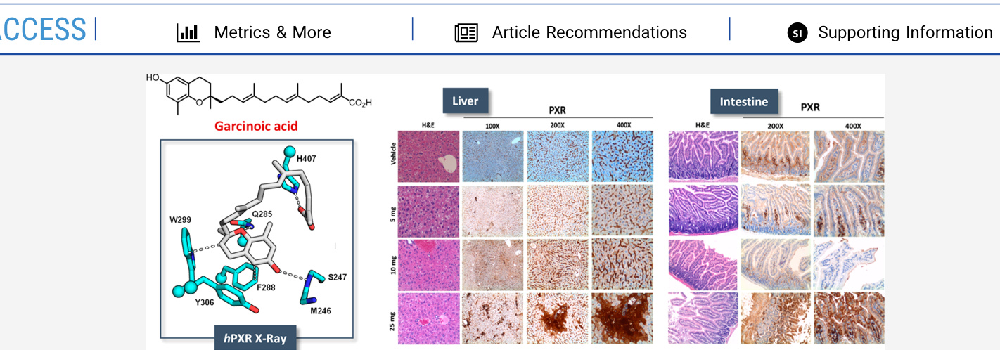
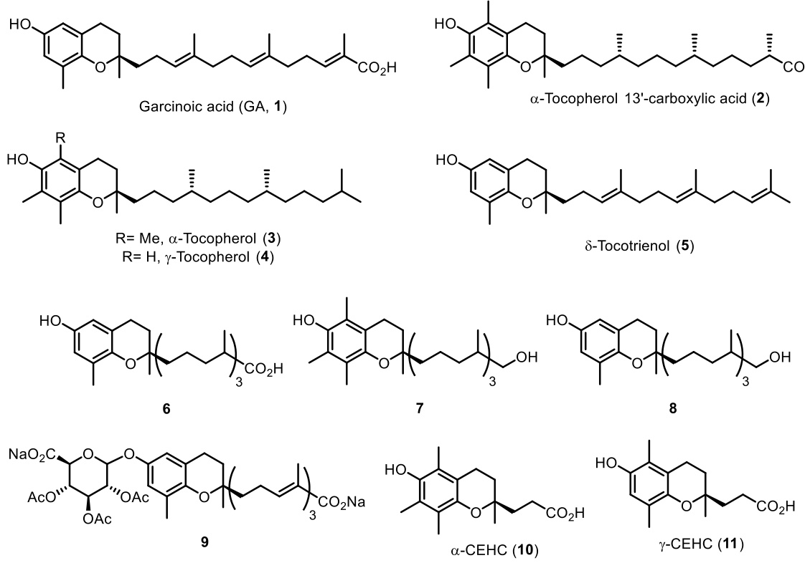
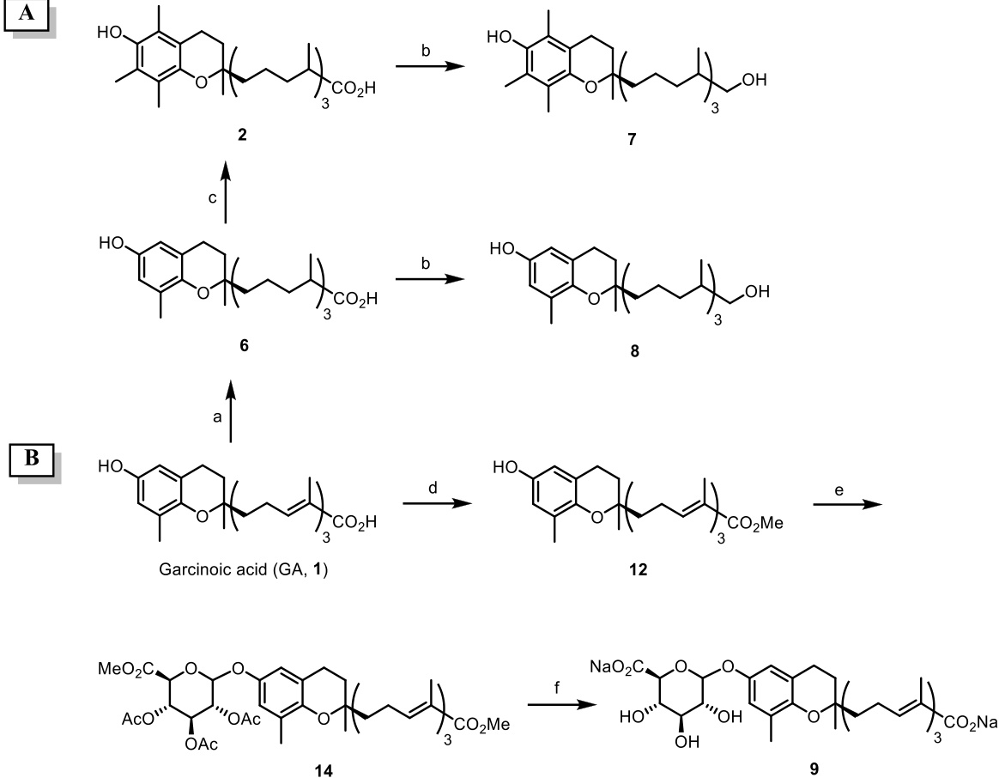
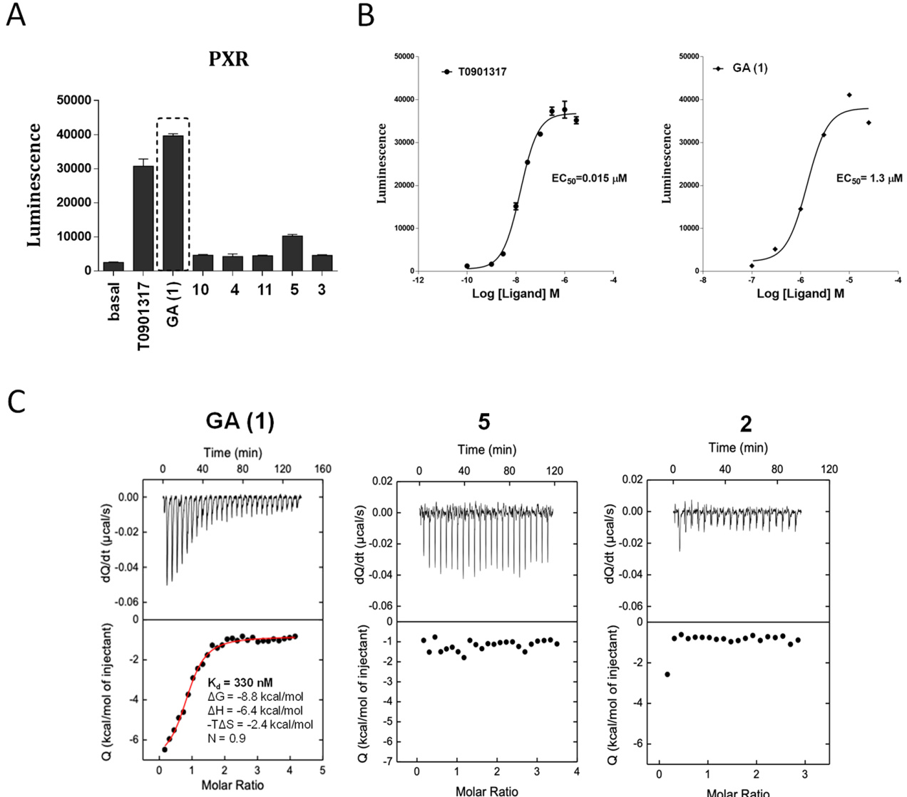
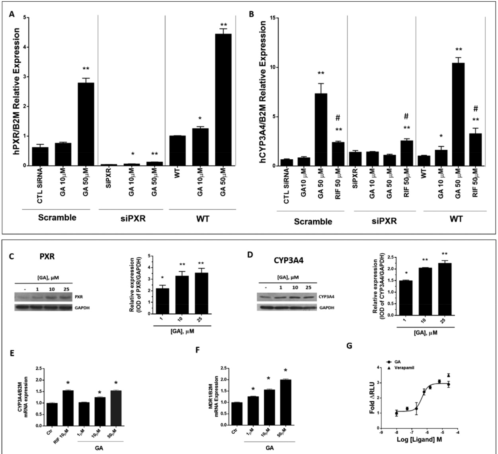
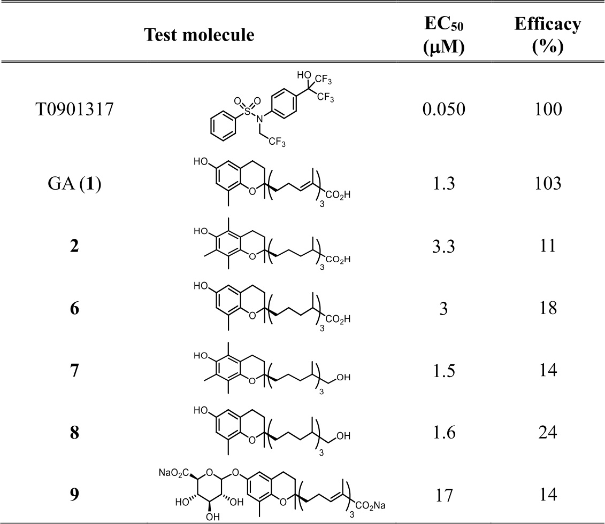
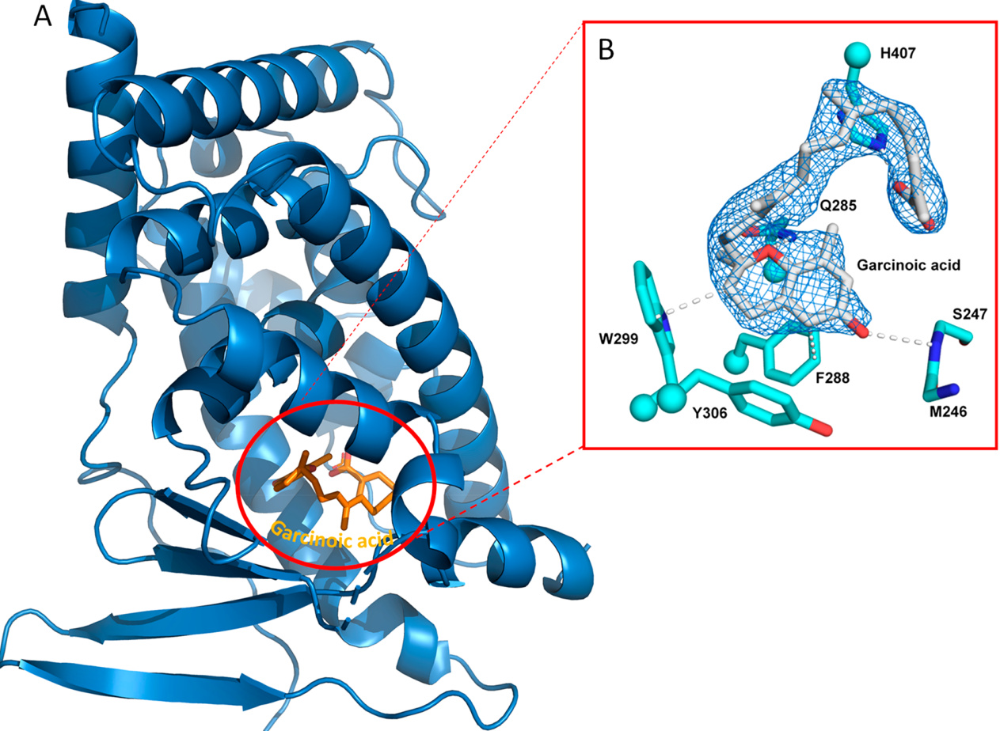
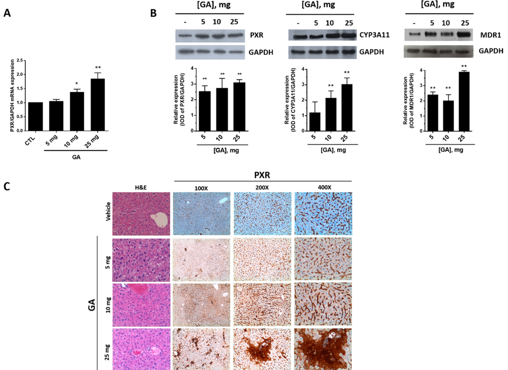
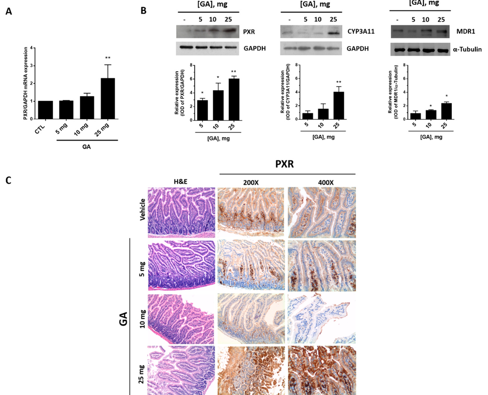

# Garcinoic Acid Is a Natural and Selective Agonist of Pregnane X Receptor  

Desirée Bartolini,● Francesca De Franco,● Pierangelo Torquato, Rita Marinelli, Bruno Cerra, Riccardo Ronchetti, Arne Schon, Francesca Fallarino, Antonella De Luca, Guido Bellezza, Ivana Ferri, Angelo Sidoni, William G. Walton, Samuel J. Pellock, Matthew R. Redinbo, Sridhar Mani, Roberto Pellicciari, Antimo Gioiello,\* and Francesco Galli\*  

# Cite This: J. Med. Chem. 2020, 63, 3701−3712  

  

ABSTRACT: Pregnane X receptor (PXR) is a master xenobiotic-sensing transcription factor and a validated target for immune and inflammatory diseases. The identification of chemical probes to investigate the therapeutic relevance of the receptor is still highly desired. In fact, currently available PXR ligands are not highly selective and can exhibit toxicity and/or potential off-target effects. In this study, we have identified garcinoic acid as a selective and efficient PXR agonist. The properties of this natural molecule as a specific PXR agonist were demonstrated by the screening on a panel of nuclear receptors, the assessment of the physical and thermodynamic binding affinity, and the determination of the PXR-garcinoic acid complex crystal structure. Cytotoxicity, transcriptional, and functional properties were investigated in human liver cells, and compound activity and target engagement were confirmed in vivo in mouse liver and gut tissue. In conclusion, garcinoic acid is a selective natural agonist of PXR and a promising lead compound toward the development of new PXR-regulating modulators.  

# 1. INTRODUCTION  

Pregnane X receptor (PXR or NR subfamily 1, group I, member 2, NR1I2) is universally recognized as a master regulator of key xenobiotic and drug metabolizing genes,1,2 such as the cytochrome P450 isoform 3A4 (CYP3A4), several phase II genes, and the multidrug resistance protein 1 (MDR1).3,4 Cloned in 1998 by two independent groups,5,6 the PXR gene is principally expressed in the liver and intestine.7,8 Its activation can be elicited by a number of ligands,3,4 including endogenous steroids, such as lithocholic acid and many other cholesterol metabolites, several classes of drugs and natural products, such as antibiotics, anticancer agents, the antihypertensive nifedipine, and the antifungal clotrimazole, herbal medicines such as the antidepressant hyperforin from St. John’s wort,9 the gut microflora products indole 3-propionic acid,10,11 and some dietary phytosterols and phenolics that include vitamin E.12,13 At the same time, a limited number of PXR antagonists and activity inhibitors have also been identified,4,14 including the drugs ketoconazole and A-792611, and the natural compounds sulforaphane, sesamine, coumestrol, and camptothecin, some of which have been investigated as drug resistance factors.  

PXR activity is under the influence of molecular interactions with other nuclear receptors (NRs) and transcription factors that ultimately affect important physiological processes of the liver and small intestine. These include the regulation of inflammatory and metabolic pathways and the preservation of intestinal wall integrity.15−17  

Chart 1. Chemical Structures of Garcinoic Acid (GA, 1), $\pmb { \alpha } -$ and $\gamma$ -Tocopherol (3, 4), $\pmb { \delta }$ -Tocotrienol (5), Long-Chain Metabolites $( 2 , 6 { - } 9 )$ , and Short-Chain Carboxyethylhydroxychroman (CEHC) Metabolites (10, 11)  

  
Scheme 1. Synthesis of Metabolites 2, 6−9a  

  
aReagents and conditions: (a) $1 0 \% \ \mathrm { P d / C }$ cartridge (s-cart, $3 0 \times 4 ~ \mathrm { { m m } }$ i.d.), 1 bar (full $\mathrm { H } _ { 2 }$ mode), $2 5 ^ { \circ } \mathrm { C } ,$ $1 ~ \mathrm { m L } \mathrm { m i n } ^ { - 1 }$ ; (b) $\mathrm { L i A l H } _ { 4 } ,$ THF, $0 \ ^ { \circ } \mathrm { C } $ rt; (c) $\mathrm { { S n C l } } _ { 2 }$ , HCl $1 2 \ \mathbf { M } _ { ; }$ , $\mathrm { E t } _ { 2 } \mathrm { O } ,$ $\left( \mathrm { C H } _ { 2 } \mathrm { O } \right) _ { n } ,$ $7 0 ~ ^ { \circ } \mathrm { C } ;$ (d) $\mathrm { C H } _ { 2 } \mathrm { N } _ { 2 } ,$ $\mathrm { E t } _ { 2 } \mathrm { O } _ { 3 }$ , $0 \ ^ { \circ } \mathrm { C }  \mathrm { r t } ;$ (e) methyl-1-bromo-2,3,4-tri-O-acetyl- $\alpha$ -D-glucuronate (13), Fetizon reagent, molecular sieves, toluene; (f) ${ \mathrm { N a } } _ { 2 } { \mathrm { C O } } _ { 3 } ,$ $\mathrm { \mathbf { M e O H } , }$ rt.  

Over the years, intense research has been devoted to investigate the potential of PXR as a pharmacological target of human pathologies. The main ones include cholestatic liver disease,18 inflammatory bowel disease (IBD),19,20 and dyslipidemia.21 However, ligand promiscuity is a major obstacle in the pharmacological approach to such NR because most of the PXR modulators identified so far have other primary targets, and PXR itself could be considered an offtarget in drug development.22  

  
Figure 1. PXR agonist activity and binding properties of GA. Binding activity of GA (1) was assessed by the AlphaScreen test at $1 0 \mu \mathrm { M }$ compound concentration (A) and during a dose-dependent experiment (B). Comparisons were made with a series of vitamin E compounds and the PXR agonist $0 . 0 5 \ \mu \mathrm { M }$ T0901317 (see Table S1). Calorimetric titrations of GA binding to PXR-LBD (C) were investigated in comparison with compounds 2 and 5 dissolved in DMSO and then further diluted to $6 0 \mu \mathrm { M }$ final concentration in $2 5 \mathrm { m M }$ Hepes buffer, $\mathrm { p H } 7 . 5 _ { \mathrm { ; } }$ containing $1 5 0 ~ \mathrm { m M }$ $\mathrm { { N a C l } }$ . The final concentration of PXR-LBD in the reaction mixture was $3 \mu \mathrm { M } ,$ and DMSO was $8 \% \ \mathrm { v / v }$ .  

Studies on the antibiotic rifaximin (Xifaxan),19 a PXR agonist also used to treat diarrhea23 and hepatic encephalopathy,24 demonstrated the efficacy of this drug in the treatment of irritable bowel syndrome (IBS). Such therapeutic application received FDA approval in May $2 0 1 5 , ^ { 2 5 }$ and further studies demonstrated effects that were independent of the antibiotic activity of this compound on gut microbiota.26 As a consequence, PXR has emerged as a molecular target for the treatment of this syndrome.  

Together these aspects indicate the need for the identification of novel and selective PXR agonists.  

Recent studies suggested that some forms and metabolites of vitamin E might fulfill this aim. Podszun et al.27 demonstrated in LS 180 human colorectal adenocarcinoma cells that $\alpha$ - tocopherol $1 3 ^ { \prime }$ -carboxylic acid (2), a long-chain metabolite (LCM) of $\alpha$ -tocopherol ${ ( 3 ) , ^ { 2 8 , 2 9 } }$ and $\delta$ -tocotrienol (5) (Chart $1 ) ^ { 3 0 , 3 1 }$ show PXR agonist function up-regulating the PXRdependent gene $\boldsymbol { \mathrm { \tt ~ p ~ } }$ -glycoprotein. Other studies by some of $\mathbf { u } \mathbf { s } ^ { 3 2 }$ demonstrated an increased PXR expression in mouse brain and in vitro in embryonal cortical astrocytes treated with a natural analogue, garcinoic acid (GA, 1) (Chart 1), first described as a bioactive compound by Mazzini and colleagues.33 This is a plant derivative of $\delta$ -tocotrienol (5) with different African ethno-medicine applications.33,34 With this premise, herein we aim to explore the activity of GA (1) as PXR agonist. In pursuit of this aim, we isolated of GA (1) from Garcinia kola seeds and use the pure compound for metabolite synthesis and characterization (Chart 1). Most importantly, binding assays, gene expression profile, cocrystallization, and in vivo experiments were carried out to establish the efficacy of GA (1) as a PXR agonist and target engagement.  

# 2. RESULTS  

2.1. Isolation of Garcinoic Acid and Metabolite Synthesis. To isolate $2 9 5 \%$ pure GA (1) in sufficient amount for compound characterization and metabolite synthesis, the extraction procedures from Garcinia kola seeds available in the literature have been revised and optimized. Current extraction methods34,35 are based on Terashima protocol36 and consist of the alcoholic extraction of the seed followed by silica gel chromatography. Using our optimized approach, we were able to increase the purified GA (1) on the multigram scale. Three different parameters have been investigated to improve yield of extraction: seed mass/solvent ratio (1:1 or 2:1, $\mathbf { w } / \mathbf { v } )$ , temperature (25, 40, and $6 0 ~ ^ { \circ } \mathrm { C } )$ ), and solvent $( { \mathrm { M e O H } }$ or EtOH) (see Table S2). The best conditions were obtained using MeOH as the solvent, at $2 5 ~ ^ { \circ } \mathrm { C }$ and with a seeds/solvent ratio 1:1, $\mathbf { w } / \mathbf { v }$ (entry 3, Table S2). Using the optimized protocol, $1 . 2 ~ \mathrm { k g }$ of finely ground G. kola seeds was extracted, affording $9 . 4 ~ \mathrm { g }$ of garcinoic acid (1) ( $0 . 7 8 \%$ yield $\mathbf { w } / \mathbf { w } ,$ ).  

  
Figure 2. PXR and CYP3A4 expression in HepG2 cells treated with garcinoic acid (1). siRNA technique was used to transiently inhibit PXR (A) or CYP3A4 (B) gene expression $[ { ^ * p } < 0 . 0 5 \$ ; $^ { * * } p < 0 . 0 1$ vs WT or Ctr test; $^ { \# } p < 0 . 0 1$ vs Rifampicin (RIF)]. PXR (C) and CYP3A4 (D) protein and mRNA (E) expression were also assessed in cells treated for $2 4 \mathrm { ~ h ~ }$ with 1 and $2 5 ~ \mu \mathrm { M }$ GA (1). MDR1 mRNA expression (F) was evaluated at concentrations between 1 and $5 0 \mu \mathrm { M }$ GA. The $\mathrm { \bf P }$ -glycoprotein activity (G) was measured in the presence of GA between $5 0 ~ \mathrm { n M }$ and $2 5 \mu \mathrm { M }$ $( \bullet )$ , and Verapamil $( \pmb { \triangle } )$ was used as a control. $t$ test: control versus treatments, $^ { * } p < 0 . 0 5$ ; $^ { * * } p < 0 . 0 1$ .  

The synthesis of metabolites 2, $\mathbf { 6 - 9 }$ was performed according to Scheme 1A. In particular, hydrogenation of GA (1) was carried out under flow conditions using a packed Pd/ C cartridge, afforded compound 6 in quantitative yield. Next, reduction of the carboxylic group by means of $\mathrm { L i A l H _ { 4 } }$ in anhydrous THF at rt gave $1 3 ^ { \prime }$ -hydroxy- $\cdot \delta$ -tocopherol (8) in $8 7 \%$ isolated yield. $1 3 ^ { \prime }$ -Carboxy- $\cdot \delta \cdot$ -tocopherol (6) was also reacted with $\left( \mathrm { C H } _ { 2 } \mathrm { O } \right) _ { n }$ in the presence of $\mathrm { { S n C l } } _ { 2 }$ and HCl $1 2 \mathrm { ~ M ~ }$ in $\mathrm { E t } _ { 2 } \mathrm { O }$ at $7 0 ~ ^ { \circ } \mathrm { C }$ to obtain $\alpha$ -tocopherol $1 3 ^ { \prime }$ -carboxylic acid (2) ( $9 2 \%$ yield) readily reduced to the corresponding alcohol derivative 7 with $\mathrm { L i A l H _ { 4 } }$ in anhydrous THF ( $6 2 \%$ yield).33  

The glucuronyl metabolite of GA (9) was prepared in a threestep synthetic sequence (Scheme 1B). Thus, GA ester (12), prepared by reacting 1 with $\mathrm { C H } _ { 2 } \mathrm { N } _ { 2 }$ in $\mathrm { E t } _ { 2 } \mathrm { O }$ at $- 7 8 { } ^ { \circ } \mathrm { C }$ $( 8 9 \% )$ , was coupled with methyl-1-bromo- $^ { 2 , 3 , 4 }$ -tri-O-acetyl- $\alpha$ -D-glucuronate (13) and Fetizon reagent in toluene to give 14 in $1 9 \%$ overall yield after silica gel purification.37 Finally, mild basic hydrolysis $\mathrm { ( N a _ { 2 } C O _ { 3 } / M e O H _ {  } }$ rt) provided the desired glucuronide 9 in $1 7 \%$ isolated yield over three steps after flash chromatography.  

2.2. Identification of Garcinoic Acid as a Selective PXR Agonist. Ligand binding activity of GA (1) was explored via AlphaScreen technology over a panel of NRs that, along with hPXR (Figure 1A), included major human endocrine and metabolic receptors, such as the retinoid X receptor (RXR), constitutive androstane receptor (CAR), farnesoid X receptor (FXR), vitamin D receptor (VDR), liver X receptor (LXR) forms $\alpha$ and $\beta ,$ and the PPAR isoforms $\alpha , \delta ,$ and $\gamma$ (see Figure S1). GA (1) was compared to its analogue $\delta \cdot$ -tocotrienol (5), the vitamers 3 and 4, their short-chain metabolites (SCMs) $\alpha$ - CEHC (10) and $\gamma$ -CEHC (11), and the LCMs 2 and 8 (Chart 1). The test was performed in the presence of reference standard agonists for the different NRs. Among the vitamin E compounds, only GA showed significant PXR agonist activity (see Figure S1A). Much lower was the response of $\delta \cdot$ - tocotrienol (5), while all of the other vitamin E compounds were almost completely inactive at the receptor. Most importantly, GA (1) showed high selectivity for $\mathrm { P X R } ,$ with only a low activity at the $\scriptstyle \mathrm { L X R } \beta$ receptor (see Figure S1B). None of the other vitamin E compounds showed any appreciable agonist activity on this receptor.  

Table 1. Activity of GA (1) and Metabolites $\mathbf { \delta } _ { 2 , \ 6 - 9 }$ on PXR as Assessed by the AlphaScreen Test   

  
aData represent mean values $\pm$ SDs of at least three independent experiments.  

The activity of GA as PXR agonist was then evaluated in dose−response experiments in comparison with $\mathrm { T } 0 9 0 1 3 1 7 ^ { 3 8 }$ (Figure 2B); the resulting $\mathrm { E C } _ { 5 0 }$ values were 1.3 and $0 . 0 1 5 \mu \mathrm { M } ,$ respectively. Comparisons were also made with physiological LCM analogues 2, 6−9 (Table 1).  

All of these compounds showed $\mathrm { E C } _ { 5 0 }$ values similar to that of GA (1) (between 1.5 and $3 . 3 \mu \mathrm { M } )$ with the exception of the glucuronide 9 that showed an $\mathrm { E C } _ { 5 0 }$ value of $1 7 \mu \mathrm { M } ,$ , suggesting an interfering role of phase II derivatization for GA agonist activity.39 The percentage of efficacy as compared to T0901317 was $1 0 3 \%$ for GA and $\leq 2 4 \%$ for the other LCMs (Table 1); worthy of note, the $\delta$ -configuration of the chromanol ring was associated with a higher agonist efficacy as compared to the $\alpha$ -configuration.  

The specificity of GA agonist activity for PXR was demonstrated by the siRNA technique in HepG2 cells. When the PXR gene was transiently inhibited, a reduction of both the PXR and the CYP3A4 gene transcription responses to GA treatment was confirmed (Figure 2A and B, respectively).  

2.3. Calorimetric Titration of Garcinoic Acid Binding to the PXR Ligand Binding Domain. To obtain direct proof of interaction with the hPXR ligand binding domain (LBD), we performed an isothermic titration calorimetry (ITC) experiment using His-tagged hPXR LBD protein in solution (Figure 1C). ITC measures the affinity, $K _ { \mathrm { a } } ,$ the Gibbs energy $\ ^ { \prime } \Delta G = - R T \ln K _ { \mathrm { a } } )$ , and the changes in enthalpy, $\Delta H ,$ and entropy, $\Delta S _ { , }$ , associated with the binding of the FKK compounds ( $\Delta G = - R T$ ln $K = \Delta H - T \Delta S$ ). Enthalpic and entropic contributions to binding affinity define the nature of the forces that drive the binding reaction.40,41 GA (1) binds to a single site in LBD $\mathrm { ' } K _ { \mathrm { d } } = 3 3 0 \ \mathrm { n M } ,$ , $\Delta G = - 8 . 8 \ \mathrm { k c a l / m o l } _ { \mathrm { \ell } }$ , $\Delta H$ $= - 6 . 4 \ \mathrm { k c a l / m o l }$ , $- T \Delta S = - 2 . 4 \mathrm { \ k c a l / m o l } _ { . }$ , $N = 0 . 9$ ) (Figure 1C, left panel). In contrast, the other PXR inactive analogues, $\delta \cdot$ -tocotrienol (5) and $\alpha$ -tocopherol $1 3 ^ { \prime }$ -carboxylic acid (2), do not show any detectable binding to PXR LBD in this assay (Figure 1C, middle and right panels, respectively).  

2.4. Crystal Structure of PXR−Garcinoic Acid Complex. To determine the structural basis of the GA−PXR binding interaction, crystals of the LBD of hPXR incubated with GA (1) were grown successfully. The resultant crystals diffracted X-rays to $\bar { 2 . 3 \mathrm { ~ \AA ~ } }$ resolution and revealed GA bound in a single orientation within the PXR ligand binding pocket of LBD (Figure 3 and Table S2). The fused ring moiety of GA contacts a set of three aromatic residues (F288, W299, and Y306) in the PXR LBD, forming an array of van der Waals contacts including face-to-face (F288) and edge-to-face (W299) $\pi { - } \pi$ interactions. Other specific contacts include hydrogen bonds with the endocyclic oxygen and phenolic hydroxyl of GA with Q285 and the backbone of S247, respectively (Figure 3). Last, the carboxylate moiety of GA (1)  

  
Figure 3. Crystal structure of hPXR−garcinoic acid complex. (A) Overview of hPXR LBD−garcinoic acid complex. (B) $2 . 3 \mathrm { ~ \AA ~ }$ resolution X-ray diffraction data of crystals demonstrated that GA (gray) binds in a single orientation within the ligand binding pocket of hPXR, contacted by four amino acid side chains (cyan) and one main-chain region (M246−S247; cyan). Distances noted are in angstroms.  

forms an ionic interaction with H407. Taken together, the hPXR LBD specifically recognizes GA with numerous contacts that corroborate the potent binding of this ligand.  

2.5. In Vitro and In Vivo Target Engagement. In Vitro Data. To confirm the activity of GA as a PXR agonist, PXR protein expression was investigated in human hepatocarcinoma cells (HepG2) and immortalized hepatic progenitor cells (HepaRG) that were preliminarily investigated for compound toxicity (see Figure S2).  

In HepG2 cells, GA increased in a dose−dose-dependent manner the PXR protein expression (Figure 2C), the CYP3A4 protein and mRNA expression (Figure 2D and E, respectively), and the MDR1 gene expression and activity (Figure 2F and ${ \bf G } ,$ respectively). Even higher was the response of PXR protein to GA treatment in HepaRG cells (see Figure S3A). This activity of GA was significantly higher as compared to that of the $\alpha \cdot$ - TOH metabolites 2 and 7 (see Figure S3A). Moreover, GA reverted the PXR binding and antagonist effect of sulforaphane (see Figure S3C).42  

The GA-induced stimulation of PXR protein expression was investigated for its functional modulation on the CYP450- mediated $\omega$ -oxidation and subsequent catabolism of the $\alpha$ - TOH side chain.30 In HepG2 cells, GA treatment did not modify the level of $\alpha$ -tocopherol (3) that was rapidly taken up, compensating the depletion of this vitamin observed under standard cell culture conditions (see Figure S4A).43 On the contrary, GA stimulated both the CYP450-mediated production and the efflux of $\alpha$ -tocopherol metabolites (see Figure S4A−C). The latter finding confirms the role of GA as an activator of the PXR-dependent membrane transporter MDR1 shown earlier in Figure 2F and G, and as was already described in the literature for other LCMs, such as 2.27 GA was found to increase PXR and CYP3A4 protein expression also in the human colorectal cancer cell line HT29 and in its mucoussecreting counterpart HT29-MTX (Figure S6A−D).  

In Vivo Data. GA toxicity and PXR activation were investigated in mice after acute (single bolus) administration. At observation ( $2 4 \mathrm { h }$ after the treatment), mortality was $1 0 0 \%$ in the group treated with $1 0 0 ~ \mathrm { { m g } }$ of GA and $3 3 \%$ in the group that received $5 0 ~ \mathrm { m g }$ of GA (1). Doses of $\leq 2 5 { \mathrm { ~ m g } }$ were well tolerated as suggested by the gross appearance and behavior of the treated animals and by the post-mortem examination of liver tissue and all main organs that revealed the complete absence of signs of damage. A dose-dependent stimulation effect of GA on PXR protein and mRNA was observed in liver tissue (Figure 4A and B, respectively). PXR mRNA also increased in intestine upon GA treatment (Figure 5A). Such transcriptional response, however, was not sufficient to significantly increase PXR protein expression in this tissue (not shown), possibly due to the lower PXR levels expressed in this tissue in comparison with liver tissue (Figure 4A). GA also increased CYP3A4 (which corresponds to CYP3A11 isoform in mice) protein expression in both of the two tissues (Figures 4B and 5B).  

The response of PXR protein to GA treatment in liver and gut was confirmed by IHC evaluation. In the hepatic parenchyma (Figure 4C), PXR was mainly localized in sinusoidal endothelial cells. In mice treated with $2 5 \mathrm { \ m g }$ of GA, PXR staining also localized in hepatocytes, particularly around centrolobular veins (zone 3) and the lobular midzonal area (zone 2). In small bowel from control group mice, PXR expression localized exclusively in the lamina propria, lymphocytes, and plasma cells of intestinal villi, without any significant staining of enterocytes (Figure 5C). On the contrary, in mice treated with GA, a strong and diffuse PXR expression was observed in villous epithelium (enterocytes) and focally also in the glandular epithelium of crypts at the base of mucosa. Furthermore, a weak staining was present on the brush border of enterocytes in mice treated with $1 0 ~ \mathrm { m g }$ of GA (Figure 5C).  

  
Figure 4. PXR, CYP3A4, and MDR1 expression in the liver of mice treated with garcinoic acid (1). Mice were treated with increasing doses of GA from 5 to $2 5 ~ \mathrm { m g }$ administered as a single bolus, and PXR mRNA (A) and protein expression (B, left panel) were measured in liver samples $2 4 \mathrm { ~ h ~ }$ post-treatment. CYP3A4 (CYP3A11 in mice) and MDR1 protein expression were also investigated (B, middle and right panels); $^ { * } p < 0 . 0 5 .$ ; $^ { * * } p <$ 0.01. Liver histology was examined by hematoxylin and eosin (H&E) staining and IHC for PXR antigen (C).  

# 3. DISCUSSION AND CONCLUSIONS  

The present study conclusively demonstrates that GA (1) is an efficient natural agonist of PXR. This finding was obtained by optimizing the isolation protocol of 1 to reach a level of purity and quantity of the compound sufficient to carry out the synthesis of other metabolites and to get insight into compound binding and activity at PXR. These properties of GA were investigated with different approaches, including screening on a panel of $\mathrm { N R s } ,$ physical and thermodynamic (calorimetric) evaluation of binding affinity, cocrystallization experiments, and then in vitro and in vivo transcriptional and functional assessment.  

In line with the in vitro binding affinity results, crystallographic data were indicative of GA binding potency that can be explained by the presence of several and stable interactions (Figure 3). These include van der Waals contacts between the chroman ring of GA and three aromatic residues (F288, W299, and Y306), hydrogen bonds established by the endocyclic oxygen and phenolic hydroxyl group of GA with residue Q285 and the backbone of S247, and the crucial ionic interaction of the carboxylate moiety of GA with H407 (Figure 4).  

The transcriptional function of PXR affects genes encoding drug-metabolizing enzymes and transporters to essentially detoxify and eliminate xenobiotics and endotoxins.1,2,15 This gene regulation function of PXR has been explained on the basis of its interaction with other NRs and regulatory proteins; upon activation, PXR typically heterodimerizes with the retinoid X receptor (RXR) to recruit coactivators, instead of corepressors, that modulate the binding of the heterodimer with specific responsive elements in the promoter regions of target genes. For example, in the proximal promoter region of CYP3A4, a repeat of one-half hexamers divided by six nucleotides was recognized as a proximal PXR responsive element (2169/2152).6 Additionally, the CYP3A4 promoter includes the xenobiotic responsive enhancer module (XREM), a distal enhancer sequence containing two extra PXR responsive elements.44−46  

MDR1 (or P-gp) is also a PXR reporter gene in liver cells, and recent reports showed the hepatic metabolite 2 as able to stimulate this gene,27 consistent with a role of PXR not only as xenosensor15 and master regulator of vitamin E metabolism,48 but also as a sensor of its biotransformation products28 and candidate receptor for this family of natural products with marked selectivity for dimethyl and unsaturated forms.  

In this respect, GA shows unique properties among the entire family of vitamin E compounds investigated in this study, being the most potent enhancer of PXR activity and consequently of vitamin E biotransformation in human liver cells. In fact, the upregulation of key genes in vitamin E metabolism, such as $\mathrm { C Y P 3 A 4 } ^ { 3 0 , 3 1 }$ and the phase III gene MDR1,27,29 stimulates the $\omega$ -hydroxylation of cellular $\alpha$ tocopherol (3) and the efflux of its LCMs 7 and 2 (Figure S3) that definitely are bioactive metabolites.27,29,49 These aspects also suggest that PXR may play a central role in the GI tract, particularly in the liver, to discriminate between $\alpha$ - tocopherol, other vitamers, and metabolites of vitamin E.13,28,29  

  
Figure 5. PXR, CYP3A4, and MDR1 expression in the intestine of mice treated with garcinoic acid (1). Mice were treated with increasing doses of GA from 5 to $2 5 \mathrm { m g }$ administered as a single bolus, and PXR mRNA (A) and protein expression (B, left panel) were measured in liver samples $2 4 \mathrm { h }$ post-treatment. CYP3A4 (CYP3A11 in mice) and MDR1 protein expression were also investigated (B, middle and right panels); $^ { * } p < 0 . 0 5$ ; $^ { * * } p <$ 0.01. Liver histology was examined by hematoxylin and eosin (H&E) staining and IHC for PXR antigen (C).  

Important enough, after we screened the binding of GA over a panel of NRs, this compound showed selective agonist activity at PXR (see Figure S1). No response to GA and other analogues with tocol-like structure was observed on PPARs and FXR, RAR, and RXR. CAR, another NR originally proposed to help explain the CYP3A-dependent metabolism of vitamin E in human hepatocytes30,48 and characterized by constitutive activation, was partially inhibited during affinity binding experiments with GA. These findings support selective action of GA for PXR and shed light on future applications of GA in targeted chemoprevention and therapy protocols of PXR-expressing organs, such as the liver, intestine, and to a slighter extent the kidney. In fact, the role of PXR as transcriptional regulator of xenobiotic and drug metabolizing genes with a broad substrate promiscuity has represented the major drawback for the pharmacological approach to the receptor.22 In this respect, GA represents a novel and selective PXR agonist, holding great potential in the development of therapeutic agents for a range of human pathologies that include cholestatic liver disease,18 dyslipidemia,21 and IBD;19,20 furthermore, recently rifaximin has received FDA approval for IBS treatment.25  

Our in vivo data unequivocally demonstrate that both intestinal and liver PXR respond to the agonist activity of GA, thus providing mechanistic support for the investigation of this natural compound in PXR-related diseases of the liver and gut. In a recent study, we also demonstrated PXR agonist activity of GA in the mouse brain as well as in isolated astrocytes,32 compatible with the role of this NR in the ApoE-mediated detoxification of amyloid- $\beta$ peptide, a molecule with a pathogenic role in Alzheimer’s disease.  

The present findings on PXR agonist activity of GA add further and important information to the biological activity of this natural analogue of vitamin E.34 In this context, GA can be exploited as a valuable chemical probe and lead compound for medicinal chemistry explorations to disclose novel therapeutic agents for the prevention and treatment of lipotoxicity and chronic inflammatory diseases, such as atherosclerosis,34 IBD, nonalcoholic fatty liver disease, and steatohepatitis.50,51 Current studies are directed toward the preparation of GA (1) derivatives with improved potency, molecular properties, and metabolic stability, the results of which will be reported in due course.  

# 4. EXPERIMENTAL SECTION  

4.1. Chemistry. General Methods. Unless otherwise noted, chemicals were obtained from commercial suppliers and used without further purification. NMR spectra were recorded on a Bruker AC 400 MHz spectrometer in the indicated solvent. Chemical shifts are reported in parts per million (ppm) and are relative to $\mathrm { C D C l } _ { 3 }$ (7.26 and $7 7 . 0 \ : \mathrm { p p m } \rangle$ or to $\mathrm { C D } _ { 3 } \mathrm { O D }$ (3.31 and $4 9 . 2 \ \mathrm { p p m } ,$ . The abbreviations used are as follows: s, singlet; brs, broad singlet; d, doublet; dd, double doublet; $\mathbf { t } ,$ triplet; ${ \mathfrak { q } } ,$ quartet; ${ \bf m } ,$ multiplet; brm, broad multiplet. Melting points were determined by the capillary method using a Buchi 535 instrument, and they were not corrected. TLC was performed on aluminum backed silica plates (silica gel 60 F254). Flash chromatographic purifications were performed via Biotage Isolera Prime using the appropriate cartridge, eluent, and gradient. Hydrogenations were performed with H-Cube apparatus (Thalesnano Nanotechnology Inc., Budapest, Hungary) using a $1 0 \%$ $\mathrm { P d / C }$ cartridge (s-cart, $3 0 \times 4 ~ \mathrm { { m m } }$ i.d.). With the exception of compound 9, all of the synthesized compounds have been previously reported, and their spectroscopic and analytical data were consistent with the literature.33,35,52 The purity of the synthesized compounds $( > 9 5 \% )$ was assessed by HPLC−HRMS.  

Isolation of Garcinoic Acid (1). Finely ground seeds $( 1 . 2 \ \mathrm { k g } )$ of Garcinia kola were suspended in MeOH (1.2 L) and stirred at $2 \bar { 5 } ~ ^ { \circ } \mathrm { C }$ for $6 . 5 \mathrm { ~ h ~ }$ . The resulting suspensions were filtered off under vacuum, and the resulting solid residue was resuspended in MeOH (1.2 L) and stirred at $2 5 ~ ^ { \circ } \mathrm { C }$ for a further $1 7 . 5 \mathrm { h }$ . The suspension was filtered again under vacuum, affording a crude brownish oil $( 5 6 ~ \mathrm { g } )$ . The crude was purified by silica gel flash chromatography (eluent: $\mathrm { C H } _ { 2 } \mathrm { C l } _ { 2 } / \mathrm { M e O H } ,$ from 100:0 to $9 0 { : } 1 0 , \ \mathrm { v / v } ,$ ), affording $9 . 4 \mathrm { ~ g ~ }$ (yield $0 . 7 8 \%$ , w/w) of $2 9 5 \%$ pure (determined by HPLC−HRMS analysis) garcinoic acid (1) as a yellow-green oil.52 $\mathrm { ^ { i } H }$ NMR ( $4 0 0 \mathrm { M H z } ,$ $\mathrm { C D C l } _ { 3 }$ ): $\delta 1 . 2 7$ $\langle 3 \mathrm { H } ,$ s), 1.53−1.61 $( \mathrm { i H } , \mathrm { m } )$ , 1.63 $( 6 \mathrm { H } , \mathrm { m } )$ , $1 . 7 5 \mathrm { - } 1 . 7 9$ $( 2 \mathrm { H } , \mathrm { m } )$ , 1.84 (3H, s), 1.99−2.01 $( 2 \mathrm { H } , \mathrm { m } )$ , $2 . 0 6 { - } 2 . 1 3$ $( 9 \mathrm { H } , \mathrm { m } )$ , 2.20 (3H, s), 2.29−2.30 $( 2 \mathrm { H } , \mathrm { m } )$ , 2.70 (2H, $\mathrm { t } , J = 6 . 4 9 \mathrm { H z } ,$ , $5 . 1 3 \mathrm { - } 5 . 1 4$ $( 2 \mathrm { H } , \mathrm { m } )$ ), 6.41 (1H, d, J $= 2 . 5 1 \ \mathrm { H z }$ ), 6.50 (1H, d, $J { = } 2 . 5 2 ~ \mathrm { H z }$ ), 6.88−6.92 $\mathrm { ( 1 H , ~ m ) }$ ). $^ { 1 3 } \mathrm { \dot { C } }$ NMR $\left( 1 0 0 . 6 ~ \mathrm { M H z } , \right.$ $\mathrm { C D C l } _ { 3 }$ ): δ 12.0, 15.8, 15.9, 16.0, 22.1, 22.4, 24.0, 26.4, 27.5, 31.3, 38.0, 39.5, 42.0, 77.3, 112.6, 115.7, 121.2, 124.4, 125.1, 126.9, 127.3, 133.7, 134.8, 145.0, 145.9, 147.7, 173.3.  

Crystallization, X-ray Diffraction Data Collection, and Structure Refinement. PXR-LBD-SRC-1p was incubated with $\mathrm { ~ 1 ~ m M }$ GA and then crystallized in $3 0 \%$ $\left( \mathbf { v } / \mathbf { v } \right)$ MPD and $1 0 0 ~ \mathrm { m M }$ imidazole/HCl pH 7.0 by the hanging drop vapor diffusion method at $4 ~ ^ { \circ } \mathrm { C }$ . Diffraction data were collected at $1 0 0 \mathrm { ~ K ~ }$ at APS Beamline 23-ID-D. Data were reduced in $\mathrm { X D S } ^ { 5 4 , 5 5 }$ and scaled in Aimless.55 The tethered PXR-LBD/ SRC-1p-GA structure was solved via molecular replacement in Phenix using the tethered PXR-LBD/SRC-1p apo structure (PDB: 3CTB). The model was refined using Phenix with manual adjustments using Coot as necessary. Coordinates and structure factors have been deposited to the PDB with accession code 6P2B.  

4.2. Biology. Cloning, Expression, and Purification of PXR-LBD/ $S R C - 1 p$ . Tethered PXR-LBD/SRC-1p was synthesized via GenScript. The gene product was subsequently subcloned into the pLIC-His pMCSG7 expression vector. Site-directed mutagenesis of the Nterminal tag was performed to replicate the construct used for a previously determined PXR crystal structure (PDB: 3CTB).53 The final expression vector containing the His-tagged PXR-LBD/SRC-1p construct was transformed into E. coli BL21(DE3) cells. A $1 0 0 ~ \mathrm { m L }$ overnight culture supplemented with $1 0 0 ~ \mu \mathrm { g / m L }$ ampicillin was used to inoculate a $1 . 5 \mathrm { { L } }$ culture supplemented with $1 0 0 ~ \mu \mathrm { g / m L }$ ampicillin at $3 7 ^ { \circ } \mathrm { C }$ until the $\mathrm { O D } _ { 6 0 0 }$ was approximately 0.6. The temperature was reduced to $1 8 \ { } ^ { \circ } { \mathrm { C } } ,$ and expression was induced with the addition of 0.1 mM isopropyl $\beta$ -D-thiogalactopyranoside and continued overnight. The next day, cells were harvested and frozen at $- 8 0 ~ ^ { \circ } \mathrm { C }$ prior to purification. Protein was purified by Ni affinity chromatography and size exclusion chromatography using the following buffers: Ni A − 25 mM HEPES, $\mathrm { \tt { p H } } 7 . 9 _ { i }$ $5 \%$ v/v glycerol, $1 5 0 \ \mathrm { m M \ N a C l }$ , 1 mM DTT, 10 mM imidazole; $\mathrm { N i } \ \mathrm { B } - 2 5 \ \mathrm { m M }$ HEPES, pH 7.9, $5 \% \mathrm { \ v / \ v }$ glycerol, 150 mM NaCl, $1 ~ \mathrm { m M }$ DTT, $2 5 0 ~ \mathrm { m M }$ imidazole; $\mathrm { G F } - 2 5 ~ \mathrm { m M }$ HEPES, pH 7.9, $5 \% \ \mathrm { v / v }$ glycerol, $\mathrm { 1 5 0 ~ m M ~ N a C l , }$ $\boldsymbol { 5 } \mathrm { m M }$ DTT.  

AlphaScreen Assay of Nuclear Receptor Binding. The activity of nuclear receptors was determined using AlphaScreen technology, a recruitment coactivator assay previously described.56  

Expression and Purification of His-Tagged PXR Ligand Binding Domain (LBD) Protein. The expression and purification of His-tagged PXR Ligand Binding Domain (LBD) protein were performed as published with minor modifications.57 For the expression of the protein, Luria−Bertani (LB) media were inoculated with a saturated culture of BL21-Gold cells transformed with HIS-LIC plasmid containing the PXR LBD construct. The mixture was then allowed to shake at $3 7 ~ ^ { \circ } \mathrm { C }$ until the cells reached an $\mathrm { O D } _ { 6 0 0 } \approx 0 . 6$ . The temperature was then reduced to $1 8 \ ^ { \circ } \mathrm { C } ,$ at which time IPTG was added (final concentration of $0 . 1 \ \mathrm { m M }$ ) to induce protein expression. For purification of PXR-LBD, the His-tag was not removed, and the uncleaved protein was loaded onto the gel filtration column with buffer [HEPES $\left( 2 5 \mathrm { \ m M } , \mathrm { p H } 7 . 5 \right)$ and $\mathrm { \Delta N a \bar { C } l }$ ( $\mathrm { 1 5 0 ~ m M } )$ ].  

Isothermal Titration Calorimetry (ITC). ITC was performed using a VP-ITC microcalorimeter from MicroCal/Malvern Instruments (Northampton, MA). The protein and the ligands (in DMSO, $8 \%$ vol/vol final concentration) were prepared in $2 5 ~ \mathrm { m M }$ Hepes, $\mathrm { p H } 7 . 5$ with $1 5 0 \ \mathrm { m M \ N a C l }$ . In all of the experiments, the ligand solution was injected in $_ { \mathrm { 1 0 - / / L } }$ aliquots into the calorimetric cell containing PXRLBD $\big [ 3 \mu \mathbf { M } \big ]$ at $3 7 \ ^ { \circ } \mathrm { C } .$ . The respective concentrations of GA (1), 2, and 5 in the syringe were $6 0 ~ \mu \mathrm { M }$ each. The heat evolved upon each injection of the ligands was obtained from the integral of the calorimetric signal. The heat associated with binding to PXR-LBD in the cell was obtained by subtracting the heat of dilution from the heat of reaction. The individual heats were plotted against the molar ratio, and the enthalpy change $( \Delta H )$ , association constant $\left( K _ { \mathrm { a } } = 1 / K _ { \mathrm { d } } \right)$ , and stoichiometry were obtained by nonlinear regression of the data.  

Cell Studies. HepG2 (human hepatoma cell line; ATCC HB-8065, Manassas, VA) and HepaRG (HPRGC10, Thermo Fisher Scientific) cells were maintained in culture as previously described.47 Experiments were performed between passages 2 and 10. Cell viability, clonogenic activity, and apoptotic cell death were assessed as previously described (see Figure S2).58,59 HT29 human colorectal adenocarcinoma cells (ATCC HTB-38) and its mucous-secreting HT29-MTX subclone (Sigma-Aldrich) were used as intestinal cell models. HT29 cells were cultured in RPMI (Invitrogen; Life Technologies) containing $1 0 \%$ FBS $\left( \mathbf { v } / \mathbf { v } \right)$ and $1 \%$ $\left( \mathbf { v } / \mathbf { v } \right)$ L-glutamine. HT29-MTX cells (from Sigma-Aldrich) were cultured in DMEM supplemented with $2 \ \mathrm { m M }$ glutamine, $1 \%$ nonessential amino acids, and $1 0 \%$ FBS. Cells were maintained at $3 7 \mathrm { C }$ in a humidified $5 \%$ $\left( \mathbf { v } / \right)$ v) $\mathrm { C O } _ { 2 }$ atmosphere chamber and were used between passages 10 and 20.  

Immunoblot. Cells were harvested and lysed in ice-cold cell lysis buffer (Cell Signaling Technology) and $2 0 ~ \mu \mathrm { L } / \mathrm { m L }$ protease inhibitor cocktail (Roche). Murine tissues ( $\mathrm { 1 0 ~ m g }$ each) were weighed and resuspended in $3 0 0 \mu \mathrm { L }$ of PBS supplemented with NP40 (1:50) and a cocktail of protease inhibitors (Pierce, Thermo Fisher Scientific). After preliminary homogenation in a $\scriptstyle 1 - \mathrm { m L }$ potter, sonication was performed in ice (3 cycles of $1 5 \mathrm { ~ s ~ }$ each with $1 ~ \mathrm { m i n }$ intervals). After incubation in ice for $^ \mathrm { ~ 1 ~ h ~ }$ and centrifugation ( $1 2 0 0 0 ~ \mathrm { r p m }$ for $2 0 ~ \mathrm { m i n }$ at $4 ~ ^ { \circ } \mathrm { C } )$ , the supernatant was recovered, and total proteins were quantified by the BCA assay kit (Pierce, Thermo Fisher Scientific). Twenty micrograms of proteins was resolved by $1 0 - 1 2 \%$ SDS-PAGE, and immunoblot was performed using anti-PXR (H-160, 1:200 dilution; sc-25381, Santa Cruz Biotechnology, Inc.), anti-PXR (1:1000 dilution, ab192579, abcam), anti-CYP3A4 (1:1000 dilution; TA324142, OriGene Technologies, Inc., Rockville, MD), antiGAPDH (D16H11, 1:1000 dilution; #5174, Cell Signaling Technology, Beverly, MA), and anti-MDR1 (dilution 1:1000, (D3H1Q) Rabbit mAb #12683 Cell Signaling Technology, Beverly, MA, and alpha-tubulin (dilution 1:1000, Cell Signaling Technology, Beverly, MA) as primary antibodies. A horseradish peroxidase−conjugated antirabbit IgG (1:2000 dilution; #7074, Cell Signaling Technology,  

Beverly, MA) was used as the secondary antibody. The band intensity was analyzed using Gel Pro analyzer Software. The results of immunoblots are shown as relative expression of the investigated protein by correction for housekeeping protein and control test (value $= 1$ ) in each series of experiments.  

P-Glycoprotein Activity Assay. To evaluate the effects of GA on recombinant human $\mathrm { P g p }$ in a cell membrane fraction, we used the Pgp-Glo assay system (Promega, Madison, WI), according to the manufacturer’s instruction. The assay relies on the ATP dependence of the light-generating reaction of firefly luciferase.  

Gene Expression and siRNA PXR Transfection. RNA was extracted using the RNeasy Plus Kit (QIAGEN, Valencia, CA) and quantified with Implen NanoPhotometer (GmbH Germany), and cDNA synthesis was carried out using SuperScript IV (Thermo Fisher Scientific, MA). For siRNA PXR transfection, HepG2 cells were transfected with siRNAs PXR using Lipofectamine RNAiMAX Transfection Reagent (Thermo-Fischer). Reverse transfection was also carried out, and after the silencing procedure $( 2 4 \mathrm { h } )$ HepG2 cells were treated with GA for a further $2 4 \mathrm { ~ h ~ }$ .  

In Vivo Studies. The $_ { 6 - 7 }$ -weeks old C57BL/6 wild-type male mice from Charles River were kept under standard environmental conditions ( $( 2 2 \ ^ { \circ } \mathrm { C } ,$ , $3 5 \%$ relative humidity, $^ { 1 2 \mathrm { ~ h ~ } }$ dark/light cycle) with free access to tap water and a standard diet. After being shipped, mice were allowed to adapt to the new environment before the experiments were initiated. All animal experiments were approved by the Institutional Animal Care and Use Committee of the University of Perugia as well as all surgeries and treatments. Animals were divided into six treatment groups (three animals each): control (vehicle $\mathbf { \sigma } = \mathbf { \sigma }$ olive oil) and GA treated groups at the dosages of 5, 10, 25, 50, and $1 0 0 ~ \mathrm { { m g } }$ . GA was administered by oral gavage as a single bolus, and the animals were sacrificed after $2 4 \mathrm { h }$ according to institutional guidelines to collect organs for histology and biochemistry evaluation as described in the other sections.  

IHC Assay. Liver and gut mouse specimens were formalin-fixed and paraffin-embedded. Four micrometer sections were mounted on polarized glass slides and stained with hematoxylin and eosin (SigmaAldrich). Immunohistochemistry analysis of PXR (polyclonal antibody; dilution 1:200; ab217375, abcam) was performed using the Bond III (Vision BioSystems, Buffalo Grove, IL) automated slide preparation system, and Polymer Refine Detection (Vision BioSystems) was used as the antibody detection system. $^ { 3 , 3 ^ { \prime } }$ - Diaminobenzidine (DAB) was used as chromogen. The section was then counterstained with hematoxylin (Sigma-Aldrich) and mounted with DPX (06522, Sigma-Aldrich).  

Statistical Analysis. Statistically significant differences were determined using one-way analysis of variance followed by Tukey’s multiple comparison test as the post hoc test or $t$ test, and differences were considered statistically significant at $p < 0 . 0 5$ .  

# ASSOCIATED CONTENT  

# s\*ı Supporting Information  

The Supporting Information is available free of charge at https://pubs.acs.org/doi/10.1021/acs.jmedchem.0c00012.  

Supplementary figures including general methods, synthetic procedures, analytical and spectroscopic characterization of compounds 2 and 5−8, NMR spectra and HPLC−HRMS copies, ligand binding activity of GA and other vitamin E analogues on a series of nuclear receptors, cell-base tests and in vivo assays, crystallographic data collection, and refinement statistics (PDF) Molecular formula strings (CSV)  

# AUTHOR INFORMATION  

Corresponding Authors Antimo Gioiello − Department of Pharmaceutical Sciences, University of Perugia, Perugia 06122, Italy; $\circledcirc$ orcid.org/0000- 0003-0240-2006; Email: antimo.gioiello@unipg.it  

Francesco Galli − Department of Pharmaceutical Sciences, University of Perugia, Perugia 06122, Italy; Email: francesco.galli@unipg.it  

#  

uthors   
Desirée Bartolini − Department of Pharmaceutical Sciences, University of Perugia, Perugia 06122, Italy   
Francesca De Franco − Taverne di Corciano, TES Pharma, Perugia 06073, Italy   
Pierangelo Torquato − Department of Pharmaceutical Sciences, University of Perugia, Perugia 06122, Italy   
Rita Marinelli − Department of Pharmaceutical Sciences, University of Perugia, Perugia 06122, Italy   
Bruno Cerra − Department of Pharmaceutical Sciences, University of Perugia, Perugia 06122, Italy; $\circledcirc$ orcid.org/0000- 0003-2438-0792   
Riccardo Ronchetti − Department of Pharmaceutical Sciences, University of Perugia, Perugia 06122, Italy   
Arne Schon − The Department of Biology, Johns Hopkins University, Baltimore, Maryland 21218, United States   
Francesca Fallarino − Department of Experimental Medicine, University of Perugia, Perugia 06129, Italy; $\circledcirc$ orcid.org/0000- 0002-8501-2136   
Antonella De Luca − Section of Anatomic Pathology and Histology, Department of Experimental Medicine, University of Perugia, Perugia 06129, Italy   
Guido Bellezza − Section of Anatomic Pathology and Histology, Department of Experimental Medicine, University of Perugia, Perugia 06129, Italy   
Ivana Ferri − Section of Anatomic Pathology and Histology, Department of Experimental Medicine, University of Perugia, Perugia 06129, Italy   
Angelo Sidoni − Section of Anatomic Pathology and Histology, Department of Experimental Medicine, University of Perugia, Perugia 06129, Italy   
William G. Walton − Department of Chemistry, University of North Carolina, Chapel Hill, North Carolina 27599, United States   
Samuel J. Pellock − Department of Chemistry, University of North Carolina, Chapel Hill, North Carolina 27599, United States   
Matthew R. Redinbo − Department of Chemistry, University of North Carolina, Chapel Hill, North Carolina 27599, United States; $\circledcirc$ orcid.org/0000-0003-0814-5346   
Sridhar Mani − The Departments of Biochemistry, Medicine, Genetics, and Molecular Pharmacology, Albert Einstein College of Medicine, Bronx, New York 10461, United States   
Roberto Pellicciari − Taverne di Corciano, TES Pharma, Perugia 06073, Italy  

Complete contact information is available at: https://pubs.acs.org/10.1021/acs.jmedchem.0c00012  

# Author Contributions  

$\bullet _ { \mathrm { D . B . } }$ . and F.D.F. contributed equally.  

# Funding  

Part of this research was supported by the Italian Ministry of University grant program, the National Technology Agrifood Cluster, Health and Nutrition program, and the PROS.IT project (CTN01_00230_413096; completed). A.G. and F.G. have also been supported by the “Ricerca di base” grant program of the University of Perugia (completed). At the time of this research, D.B. was a postdoc fellow of the FIRC-AIRC young investigator’s grant program. S.M. was funded by NIH grants R01 CA127231 (completed), CA 161879 (completed), CA222469, Department of Defense Partnering PI (W81XWH17-1-0479; PR160167), R01 ES030197, as well as R43DK105694 (PI: Jay Wrobel, completed) and P30DK041296 (PI: Alan Wolkoff) (pilot award completed). M.R.R was funded by NIH grants CA098468 and CA207416.  

# Notes  

The authors declare the following competing financial interest(s): A.G. and R.P. are cofounders of TES Pharma.  

# ABBREVIATIONS USED  

CAR, constitutive androstane receptor; FXR, farnesoid x receptor; GA, garcinoic acid; IBD, intestinal bowel disease; IBS, irritable bowel syndrome; ITC, isothermal titration calorimetry; LBD, ligand binding domain; LCM, long-chain metabolite; LXR, liver x receptor; NR, nuclear receptor; MDR1, multidrug resistance protein 1; PPAR, peroxisome proliferator-activated receptor; PXR, pregnane x receptor; RXR, retinoid $\mathbf { x }$ receptor; SCM, short-chain metabolite; $\alpha \cdot$ - TOH, alpha-tocopherol; δ-T, gamma-tocotrienol  

# REFERENCES  

(1) Kandel, B. A.; Thomas, M.; Winter, S.; Seehofer, D.; Burk, O.;   
Schwab, M.; Zanger, U. M. Genomewide comparison of the inducible   
transcriptomes of nuclear receptors CAR, PXR and PPARalpha in   
primary human hepatocytes. Biochim. Biophys. Acta, Gene Regul. Mech.   
2016, 1859, 1218−1227.   
(2) Kliewer, S. A.; Goodwin, B.; Willson, T. M. The nuclear   
pregnane X receptor: a key regulator of xenobiotic metabolism.   
Endocr. Rev. 2002, 23, 687−70. (3) Chen, Y.; Tang, Y.; Guo, C.; Wang, J.; Boral, D.; Nie, D. Nuclear   
receptors in the multidrug resistance through the regulation of drug  
metabolizing enzymes and drug transporters. Biochem. Pharmacol.   
2012, 83, 1112−1126.   
(4) Banerjee, M.; Chen, T. Differential regulation of CYP3A4   
promoter activity by a new class of natural product derivatives binding   
to pregnane X receptor. Biochem. Pharmacol. 2013, 86, 824−835. (5) Kliewer, S. A.; Moore, J. T.; Wade, L.; Staudinger, J. L.; Watson,   
M. A.; Jones, S. A.; McKee, D. D.; Oliver, B. B.; Willson, T. M.;   
Zetterström, R. H.; Perlmann, T.; Lehmann, J. M. An orphan nuclear   
receptor activated by pregnanes defines a novel steroid signaling   
pathway. Cell 1998, 92, 73−82. (6) Blumberg, B.; Sabbagh, W., Jr.; Juguilon, H.; Bolado, J., Jr.; van   
Meter, C. M.; Ong, E. S.; Evans, R. M. SXR, a novel steroid and   
xenobiotic-sensing nuclear receptor. Genes Dev. 1998, 12, 3195−3205. (7) Fagerberg, L.; Hallström, B. M.; Oksvold, P.; Kampf, C.;   
Djureinovic, D.; Odeberg, J.; Habuka, M.; Tahmasebpoor, S.;   
Danielsson, A.; Edlund, K.; Asplund, A.; Sjöstedt, E.; Lundberg, E.;   
Szigyarto, C. A.; Skogs, M.; Takanen, J. O.; Berling, H.; Tegel, H.;   
Mulder, J.; Nilsson, P.; Schwenk, J. M.; Lindskog, C.; Danielsson, F.;   
Mardinoglu, A.; Sivertsson, A.; von Feilitzen, K.; Forsberg, M.;   
Zwahlen, M.; Olsson, I.; Navani, S.; Huss, M.; Nielsen, J.; Ponten, F.;   
Uhlén, M. Analysis of the human tissue-specific expression by   
genome-wide integration of transcriptomics and antibody-based   
proteomics. Mol. Cell. Proteomics 2014, 13, 397−406. (8) https://www.ncbi.nlm.nih.gov/gene/8856#gene-expression (ac  
cessed Nov. 15, 2019). (9) Hogle, B. C.; Guan, X.; Folan, M. M.; Xie, W. PXR as a mediator   
of herb-drug interaction. J. Food Drug Anal. 2018, 26, S26−S31. (10) Wikoff, W. R.; Anfora, A. T.; Liu, J.; Schultz, P. G.; Lesley, S.   
A.; Peters, E. C.; Siuzdak, G. Metabolomics analysis reveals large   
effects of gut microflora on mammalian blood metabolites. Proc. Natl.   
Acad. Sci. U. S. A. 2009, 106, 3698−3703. (11) Venkatesh, M.; Mukherjee, S.; Wang, H.; Li, H.; Sun, K.;   
Benechet, A. P.; Qiu, Z.; Maher, L.; Redinbo, M. R.; Phillips, R. S.;   
Fleet, J. C.; Kortagere, S.; Mukherjee, P.; Fasano, A.; Le Ven, J.; Nicholson, J. K.; Dumas, M. E.; Khanna, K. M.; Mani, S. Symbiotic bacterial metabolites regulate gastrointestinal barrier function via the xenobiotic sensor PXR and Toll-like receptor 4. Immunity 2014, 41, 296−310.   
(12) Galli, F. Interactions of polyphenolic compounds with drug disposition and metabolism. Curr. Drug Metab. 2007, 8, 830−838. (13) Galli, F.; Azzi, A.; Birringer, M.; Cook-Mills, J. M.; Eggersdorfer, M.; Frank, J.; Cruciani, G.; Lorkowski, S.; Ö zer, N. K. Vitamin E: emerging aspects and new directions. Free Radical Biol. Med. 2017, 102, 16−36.   
(14) Mani, S.; Dou, W.; Redinbo, M. R. PXR antagonists and implication in drug metabolism. Drug Metab. Rev. 2013, 45, 60−72. (15) Oladimeji, P. O.; Chen, T. PXR: more than just a master xenobiotic receptor. Mol. Pharmacol. 2018, 93, 119−127.   
(16) Cave, M. C.; Clair, H. B.; Hardesty, J. E.; Falkner, K. C.; Feng, W.; Clark, B. J.; Sidey, J.; Shi, H.; Aqel, B. A.; McClain, C. J.; Prough, R. A. Nuclear receptors and nonalcoholic fatty liver disease. Biochim. Biophys. Acta, Gene Regul. Mech. 2016, 1859, 1083−1099.   
(17) Lopez-Velazquez, J. A.; Carrillo-Cordova, L. D.; Chavez-Tapia, N. C.; Uribe, M.; Mendez-Sanchez, N. Nuclear receptors in nonalcoholic fatty liver disease. J. Lipids 2012, 2012, 139875.   
(18) Kakizaki, S.; Takizawa, D.; Tojima, H.; Horiguchi, N.; Yamazaki, Y.; Mori, M. Nuclear receptors CAR and PXR; therapeutic targets for cholestatic liver disease. Front. Biosci., Landmark Ed. 2011, 16, 2988−3005.   
(19) Cheng, J.; Shah, Y. M.; Gonzalez, F. J. Pregnane X receptor as a target for treatment of inflammatory bowel disorders. Trends Pharmacol. Sci. 2012, 33, 323−330.   
(20) Shah, Y. M.; Ma, X.; Morimura, K.; Kim, I.; Gonzalez, F. J. Pregnane X receptor activation ameliorates DSS-induced inflammatory bowel disease via inhibition of NF-kappaB target gene expression. Am. J. Physiol. Gastrointest. Liver Physiol. 2007, 292, G1114−1122. (21) Gao, J.; Xie, W. Targeting xenobiotic receptors PXR and CAR for metabolic diseases. Trends Pharmacol. Sci. 2012, 33, 552−558. (22) Lau, A. J.; Yang, G.; Yap, C. W.; Chang, T. K. Selective agonism of human pregnane X receptor by individual ginkgolides. Drug Metab. Dispos. 2012, 40, 1113−1121.   
(23) DuPont, H. L. Therapy for and prevention of traveler’s diarrhea. Clin. Infect. Dis. 2007, 45 (Suppl. 1), S78−84.   
(24) Lawrence, K. R.; Klee, J. A. Rifaximin for the treatment of hepatic encephalopathy. Pharmacotherapy 2008, 28, 1019−1032. (25) Administration USFDA. FDA Approves Two Therapies to Treat IBS-D, Release FN; U.S. Food and Drug Administration: Silver Spring, MD, 2015.   
(26) Sartor, R. B. Review article: the potential mechanisms of action of rifaximin in the management of inflammatory bowel diseases. Aliment. Pharmacol. Ther. 2016, 43 (Suppl. 1), 27−36.   
(27) Podszun, M. C.; Jakobi, M.; Birringer, M.; Weiss, J.; Frank, J. The long chain alpha-tocopherol metabolite alpha- $. 1 3 ^ { \prime }$ -COOH and gamma-tocotrienol induce P-glycoprotein expression and activity by activation of the pregnane X receptor in the intestinal cell line LS 180. Mol. Nutr. Food Res. 2017, 61, 1600605.   
(28) Galli, F.; Polidori, M. C.; Stahl, W.; Mecocci, P.; Kelly, F. J. Vitamin E biotransformation in humans. Vitam. Horm. 2007, 76, 263−280.   
(29) Schubert, M.; Kluge, S.; Schmölz, L.; Wallert, M.; Galli, F.; Birringer, M.; Lorkowski, S. Long-chain metabolites of vitamin E: metabolic activation as a general concept for lipid-soluble vitamins? Antioxidants 2018, 7, E10.   
(30) Birringer, M.; Drogan, D.; Brigelius-Flohe, R. Tocopherols are metabolized in HepG2 cells by side chain omega-oxidation and consecutive beta-oxidation. Free Radical Biol. Med. 2001, 31, 226− 232.   
(31) Birringer, M.; Pfluger, P.; Kluth, D.; Landes, N.; BrigeliusFlohe, R. Identities and differences in the metabolism of tocotrienols and tocopherols in HepG2 cells. J. Nutr. 2002, 132, 3113−3118. (32) Marinelli, R.; Torquato, P.; Bartolini, D.; Mas-Bargues, C.; Bellezza, G.; Gioiello, A.; Borras, C.; Fallarino, F.; Mani, S.; Sidoni, A.; Viña, J.; Galli, F., manuscript in preparation. (33) Mazzini, F.; Betti, M.; Netscher, T.; Galli, F.; Salvadori, P. Configuration of the vitamin E analogue garcinoic acid extracted from Garcinia Kola seeds. Chirality 2009, 21, 519−524.   
(34) Wallert, M.; Bauer, J.; Kluge, S.; Schmölz, L.; Chen, Y. C.; Ziegler, M.; Searle, A. K.; Maxones, A.; Schubert, M.; Thürmer, M.; Pein, H.; Koeberle, A.; Werz, O.; Birringer, M.; Peter, ${ \mathrm { K } } . { \mathrm { } }$ Lorkowski, S. The vitamin E derivative garcinoic acid from Garcinia kola nut seeds attenuates the inflammatory response. Redox Biol. 2019, 24, 101166.   
(35) Birringer, M.; Lington, D.; Vertuani, S.; Manfredini, S.; Scharlau, D.; Glei, M.; Ristow, M. Proapoptotic effects of long-chain vitamin E metabolites in HepG2 cells are mediated by oxidative stress. Free Radical Biol. Med. 2010, 49, 1315−1322.   
(36) Terashima, K.; Takaya, Y.; Niwa, M. Powerful antioxidative agents based on garcinoic acid from Garcinia kola. Bioorg. Med. Chem. 2002, 10, 1619−1625.   
(37) Mostarda, S.; Filipponi, P.; Sardella, ${ \mathrm { R } } . { \mathrm { } } { \mathrm { } }$ Venturoni, F.; Natalini, B.; Pellicciari, R.; Gioiello, A. Glucuronidation of bile acids under flow conditions: design of experiments and Koenigs−Knorr reaction optimization. Org. Biomol. Chem. 2014, 12, 9592−9600.   
(38) Xue, Y.; Chao, E.; Zuercher, W. J.; Willson, T. M.; Collins, J. L.; Redinbo, M. R. Crystal structure of the PXR-T1317 complex provides a scaffold to examine the potential for receptor antagonism. Bioorg. Med. Chem. 2007, 15, 2156−2166.   
(39) Dou, W.; Mukherjee, S.; Li, H.; Venkatesh, M.; Wang, H.; Kortagere, S.; Peleg, A.; Chilimuri, S. S.; Wang, Z. T.; Feng, Y.; Fearon, E. R.; Mani, S. Alleviation of gut inflammation by Cdx2/Pxr pathway in a mouse model of chemical colitis. PLoS One 2012, 7, No. e36075.   
(40) Velazquez-Campoy, A.; Todd, M. J.; Freire, E. HIV-1 protease inhibitors: enthalpic versus entropic optimization of the binding affinity. Biochemistry 2000, 39, 2201−2207.   
(41) Ruben, A. J.; Kiso, Y.; Freire, E. Overcoming roadblocks in lead optimization: a thermodynamic perspective. Chem. Biol. Drug Des. 2006, 67, 2−4.   
(42) Zhou, C.; Poulton, E. J.; Grün, F.; Bammler, T. K.; Blumberg, B.; Thummel, K. E.; Eaton, D. L. The dietary isothiocyanate sulforaphane is an antagonist of the human steroid and xenobiotic nuclear receptor. Mol. Pharmacol. 2007, 71, 220−229.   
(43) Leist, M.; Raab, B.; Maurer, S.; Rösick, U.; Brigelius-Flohé, R. Conventional cell culture media do not adequately supply cells with antioxidants and thus facilitate peroxide-induced genotoxicity. Free Radical Biol. Med. 1996, 21, 297−306.   
(44) Goodwin, B.; Hodgson, E.; Liddle, C. The orphan human pregnane X receptor mediates the transcriptional activation of CYP3A4 by rifampicin through a distal enhancer module. Mol. Pharmacol. 1999, 56, 1329−1339.   
(45) Toriyabe, T.; Nagata, K.; Takada, T.; Aratsu, Y.; Matsubara, T.; Yoshinari, K.; Yamazoe, Y. Unveiling a new essential cis element for the transactivation of the CYP3A4 gene by xenobiotics. Mol. Pharmacol. 2009, 75, 677−684.   
(46) Torquato, P.; Bartolini, D.; Giusepponi, D.; Saluti, G.; Russo, A.; Barola, C.; Birringer, M.; Galarini, R.; Galli, F. a- $1 3 ^ { \prime }$ -OH is the main product of a-tocopherol metabolism and influences CYP4F2 and PPAR- Gene expression in HepG2 human hepatocarcinoma cells. Free Radical Biol. Med. 2016, 96, S19−S20.   
(47) Russo, A.; Bartolini, D.; Torquato, P.; Giusepponi, D.; Barola, C.; Galarini, R.; Birringer, M.; Lorkowski, S.; Galli, F. CYP4F2 repression and a modified alpha-tocopherol (vitamin E) metabolism are two independent consequences of ethanol toxicity in human hepatocytes. Toxicol. In Vitro 2017, 40, 124−133.   
(48) Landes, N.; Pfluger, P.; Kluth, D.; Birringer, M.; Rühl, R.; Böl, G. F.; Glatt, H.; Brigelius-Flohé, R. Vitamin E activates gene expression via the pregnane X receptor. Biochem. Pharmacol. 2003, 65, 269−273.   
(49) Pein, H.; Ville, A.; Pace, S.; Temml, V.; Garscha, U.; Raasch, M.; Alsabil, K.; Viault, G.; Dinh, C.-P.; Guilet, D.; Troisi, F.; Neukirch, K.; König, S.; Bilancia, R.; Waltenberger, B.; Stuppner, H.; Wallert, M.; Lorkowski, S.; Weinigel, C.; Rummler, S.; Birringer, M.; Roviezzo, F.; Sautebin, L.; Helesbeux, J.-J.; Séraphin, D.; Mosig, A. S.; Schuster, D.; Rossi, A.; Richomme, P.; Werz, P. O.; Koeberle, A. Endogenous metabolites of vitamin E limit inflammation by targeting 5-lipoxygenase. Nat. Commun. 2018, 9, 3834.   
(50) Torquato, P.; Giusepponi, D.; Alisi, A.; Galarini, ${ \mathrm { R } } ;$ Bartolini, D.; Piroddi, M.; Goracci, L.; Di Veroli, A.; Cruciani, G.; Crudele, A.; Nobili, V.; Galli, F. Nutritional and lipidomics biomarkers of docosahexaenoic acid-based multivitamin therapy in pediatric NASH. Sci. Rep. 2019, 9, 2045.   
(51) Torquato, P.; Bartolini, D.; Giusepponi, D.; Piroddi, M.; Sebastiani, B.; Saluti, G.; Galarini, R.; Galli, F. Increased plasma levels of the lipoperoxyl radical-derived vitamin E metabolite $\alpha$ -tocopheryl quinone are an early indicator of lipotoxicity in fatty liver subjects. Free Radical Biol. Med. 2019, 131, 115−125.   
(52) Terashima, K.; Shimamura, T.; Tanabayashi, M.; Aqil, M.; Akinniyi, J. A.; Niwa, M. Constituents of the seeds of Garcinia Kola: two new antioxidants, garcinoic acid and garcinal. Heterocycles 1997, 45, 1559−1566.   
(53) Wang, W.; Prosise, W. W.; Chen, J.; Taremi, S. S.; Le, H. V.; Madison, V.; Cui, X.; Thomas, A.; Cheng, K. C.; Lesburg, C. A. Construction and characterization of a fully active PXR/SRC-1 tethered protein with increased stability. Protein Eng., Des. Sel. 2008, 21, 425−433.   
(54) Kabsch, W. XDS. Acta Crystallogr., Sect. D: Biol. Crystallogr. 2010, 66, 125−132.   
(55) Winn, M. D.; Ballard, C. C.; Cowtan, K. D.; Dodson, E. J.; Emsley, P.; Evans, P. R.; Keegan, R. M.; Krissinel, E. B.; Leslie, A. G. W.; McCoy, A.; McNicholas, S. J.; Murshudov, G. N.; Pannu, N. S.; Potterton, E. A.; Powell, H. R.; Read, R. J.; Vagin, A.; Wilson, K. S. Overview of the CCP4 suite and current developments. Acta Crystallogr., Sect. D: Biol. Crystallogr. 2011, 67, 235−242.   
(56) Rizzo, G.; Passeri, D.; De Franco, F.; Ciaccioli, G.; Donadio, L.; Rizzo, G.; Orlandi, S.; Sadeghpour, B.; Wang, X. X.; Jiang, T.; Levi, M.; Pruzanski, M.; Adorini, L. Functional characterization of the semisynthetic bile acid derivative INT-767, a dual farnesoid X receptor and TGR5 agonist. Mol. Pharmacol. 2010, 78, 617−630. (57) Wallace, B. D.; Betts, L.; Talmage, G.; Pollet, R. M.; Holman, N. S.; Redinbo, M. R. Structural and functional analysis of the human nuclear xenobiotic receptor PXR in complex with RXRα. J. Mol. Biol. 2013, 425, 2561−2577.   
(58) Mosmann, T. Rapid colorimetric assay for cellular growth and survival: application to proliferation and cytotoxicity assays. J. Immunol. Methods 1983, 65, 55−63.   
(59) Bartolini, D.; Commodi, J.; Piroddi, M.; Incipini, L.; Sancineto, L.; Santi, C.; Galli, F. Glutathione S-transferase pi expression regulates the Nrf2-dependent response to hormetic diselenides. Free Radical Biol. Med. 2015, 88, 466−480.  