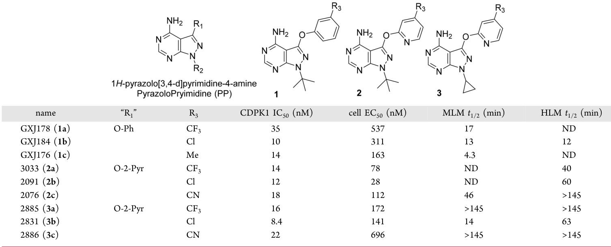
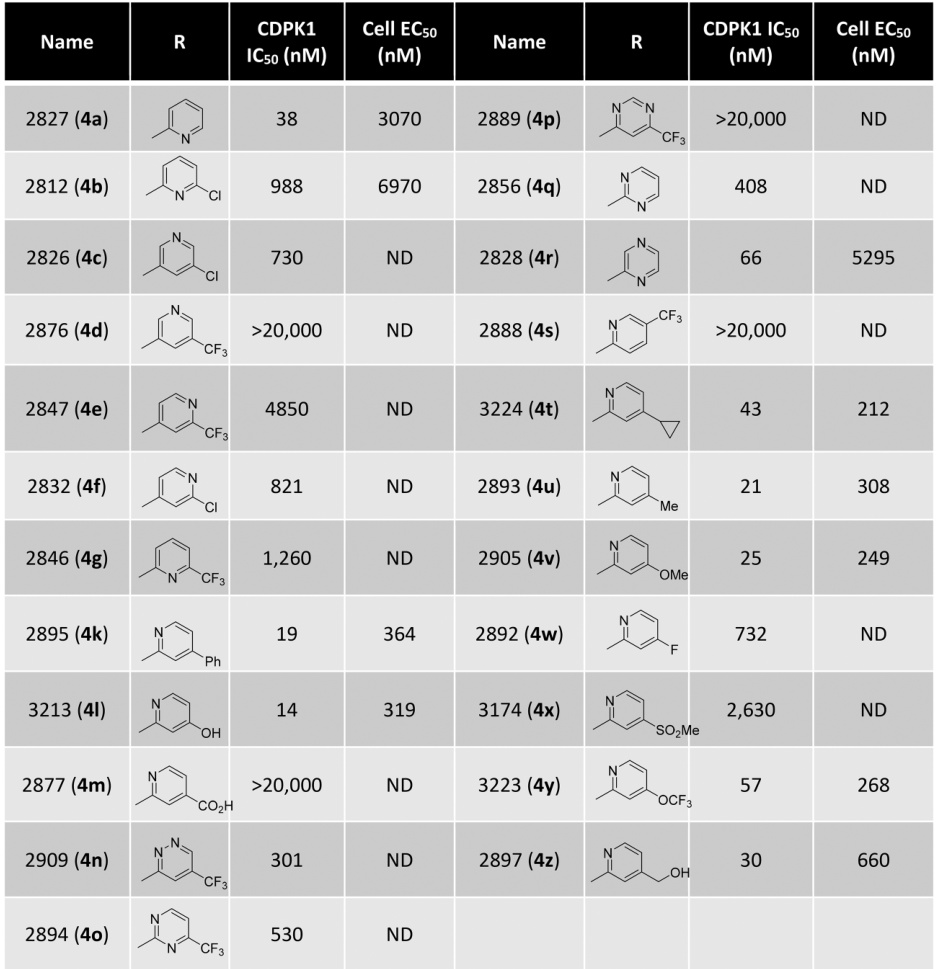
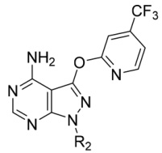
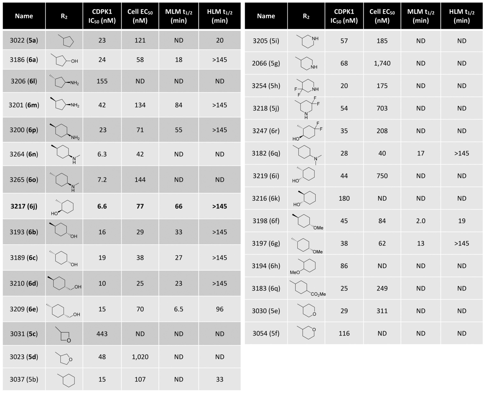
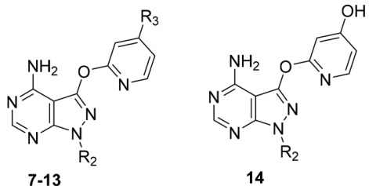
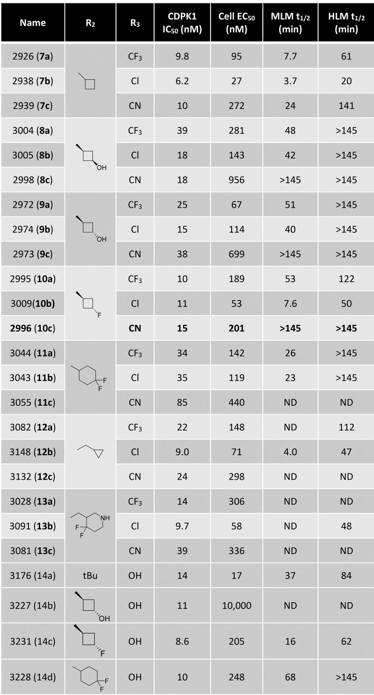
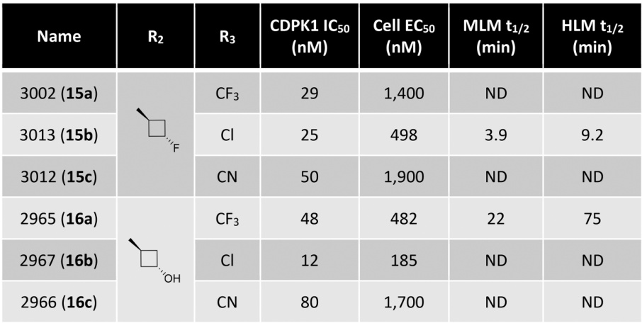

# 1. 论文标题
Optimizing Pyrazolopyrimidine Inhibitors of Calcium Dependent Protein Kinase 1 for Treatment of Acute and Chronic Toxoplasmosis

# 2. 论文作者
James W. Janetka, Allen T. Hopper, Ziping Yang, Jennifer Barks, Mary Savari Dhason, Qiuling Wang, and L. David Sibley

# 3. 论文研究内容以及主要贡献
该论文研究了钙依赖性蛋白激酶1（CDPK1）的吡唑并嘧啶类抑制剂，用于治疗弓形虫病。通过理性设计、合成和测试一系列新型吡唑并嘧啶类似物，评估了其在体外抑制CDPK1酶活性和在细胞培养中抑制寄生虫生长的能力。优化后的先导化合物3a显示出优异的效力、选择性、安全性和体内疗效，为进一步优化CDPK1抑制剂治疗急性和慢性弓形虫病奠定了基础。

# 4. 分子改进路线叙述
## 路线一
### （1）改进前分子信息
- **位置**：[Table 1]
- **分子化学式（smiles）**：[无法获取SMILES，原文称为“1a”]
- **分子结构所在图像**：

- **存在问题**：[在小鼠肝微粒体中稳定性极低（半衰期约为10分钟）]

### （2）改进部位
[在R1位置将苯基醚替换为2-吡啶基醚]

### （3）改进依据
[基于X射线结构，认为在邻位添加氮原子（2-吡啶基）可以通过与4-氨基NH2的内部氢键锁定4-Cl-2-吡啶基环的结合构象，同时显著改变化合物的物理性质和代谢谱]

### （4）改进后分子信息
- **位置**：[Table 1]
- **分子化学式（smiles）**：[无法获取SMILES，原文称为“2b”]
- **分子结构所在图像**：

## 路线二
### （1）改进前分子信息
- **位置**：[Table 1]
- **分子化学式（smiles）**：[无法获取SMILES，原文称为“2a-c”]
- **分子结构所在图像**：

- **存在问题**：[R2基团为叔丁基，代谢稳定性可能不高]

### （2）改进部位
[将R2位置的叔丁基替换为环丙基]

### （3）改进依据
[环丙基通常比叔丁基更小、亲脂性更低，且代谢更稳定]

### （4）改进后分子信息
- **位置**：[Table 1]
- **分子化学式（smiles）**：[无法获取SMILES，原文称为“3a-c”]
- **分子结构所在图像**：

## 路线三
### （1）改进前分子信息
- **位置**：[Table 2]
- **分子化学式（smiles）**：[无法获取SMILES，原文称为“4a”]
- **分子结构所在图像**：

- **存在问题**：[R1取代基种类较少，代谢稳定性有待提高]

### （2）改进部位
[在R1位置引入不同的杂芳基醚取代基，并对R3位置进行优化]

### （3）改进依据
[通过改变R1和R3取代基，探索构效关系，提高代谢稳定性]

### （4）改进后分子信息
- **位置**：[Table 2]
- **分子化学式（smiles）**：[无法获取SMILES，原文称为“4b-4z”]
- **分子结构所在图像**：

## 路线四
### （1）改进前分子信息
- **位置**：[Table 3]
- **分子化学式（smiles）**：[无法获取SMILES，原文称为“5a,5b”]
- **分子结构所在图像**：

- **存在问题**：[R2取代基种类较少，代谢稳定性有待提高]

### （2）改进部位
[在R2位置引入不同的环烷基和杂环基团]

### （3）改进依据
[通过改变R2取代基，探索构效关系，提高代谢稳定性]

### （4）改进后分子信息
- **位置**：[Table 3]
- **分子化学式（smiles）**：[无法获取SMILES，原文称为“5c-6q”]
- **分子结构所在图像**：

## 路线五
### （1）改进前分子信息
- **位置**：[Table 4]
- **分子化学式（smiles）**：[无法获取SMILES，原文称为“7a-13c”]
- **分子结构所在图像**：

- **存在问题**：[部分化合物代谢稳定性不高]

### （2）改进部位
[在R1位置引入不同的2-吡啶基，并在R2位置引入不同的取代基]

### （3）改进依据
[通过改变R1和R2取代基，探索构效关系，提高代谢稳定性]

### （4）改进后分子信息
- **位置**：[Table 4]
- **分子化学式（smiles）**：[无法获取SMILES，原文称为“7a-13c”]
- **分子结构所在图像**：

## 路线六
### （1）改进前分子信息
- **位置**：[Table 5]
- **分子化学式（smiles）**：[无]
- **分子结构所在图像**：

- **存在问题**：[吡啶基在细胞活性和代谢稳定性方面有优势，但苯基醚类化合物的构效关系仍需探索]

### （2）改进部位
[将R1位置的吡啶基醚替换为苯基醚，并在R2位置引入不同的取代基]

### （3）改进依据
[对比吡啶基醚和苯基醚类化合物的活性和代谢稳定性]

### （4）改进后分子信息
- **位置**：[Table 5]
- **分子化学式（smiles）**：[无]
- **分子结构所在图像**：

# 5. 分子改进后适用于什么疾病
弓形虫病（急性和慢性）

# 6. 改进前后分子的关键指标数据对比
| 改进路线 | 改进前分子（SMILES）         | 改进部位（具体基团）       | 改进后分子（SMILES）         | 指标1（IC50/nM） | 指标2（HLM t1/2/min） | 指标3（Cell EC50/nM） |
|----------|-----------------------------|---------------------------|-----------------------------|------------------|---------------------------|-------------------|
| 路线一   | 化合物1a（无SMILES）         | R1:苯基醚→2-吡啶基醚       | 化合物2b（无SMILES）         | 35→12           | 12→60                      | 537→28           |
| 路线二   | 化合物2a（无SMILES）         | R2:叔丁基→环丙基          | 化合物3a（无SMILES）         | 14→16           | 40→>145                    | 78→172           |
| 路线三   | 化合物4a（无SMILES）         | R1:2-吡啶基，R3多样化       | 化合物4l（无SMILES）         | 38→14           | -                         | 3070→319          |
| 路线四   | 化合物5a（无SMILES）         | R2:环戊基→多种环烷基/杂环 | 化合物6j（无SMILES）         | 23→6.6          | -                         | 121→77            |
| 路线五   | 化合物7a（无SMILES）         | R1:2-吡啶基，R2多样化       | 化合物10c（无SMILES）        | 9.8→15          | 61→>145                    | 95→201            |
| 路线六   | 化合物15a（无SMILES）        | R1:苯基醚，R2多样化        | 化合物15a（无SMILES）        | 29→29           | -                         | 1400→1400         |
